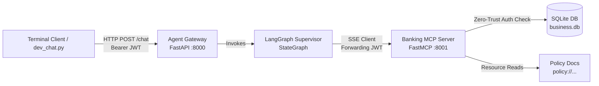

# Bank Loan Agentic Platform

Agentic banking platform combining **Model Context Protocol (MCP)**, **LangGraph**, and **FastAPI** for secure, automated loan processing, account inquiries, policy evaluations, and financial calculations under a Zero Trust Architecture.

---

## Architecture Overview



- **`data/`**: SQLite database (`business.db`) storing user accounts and loans, plus text policy documents (`retail_policy.txt`, `corporate_policy.txt`).
- **`mcp_server/`**: FastMCP server running over SSE (port `8001`). Exposes bank policies (resources) and protected loan/user database operations (tools) that enforce JWT signature verification before querying data.
- **`agent_gateway/`**: FastAPI service (port `8000`) hosting authentication endpoints (`/auth/login`) and the LangGraph supervisor agent graph.
- **`scripts/`**:
  - `init_db.py`: Initializes SQLite database and seeds test users & loans.
  - `generate_dev_tokens.py`: Generates pre-signed JWT tokens for test personas.
  - `dev_chat.py`: Interactive CLI client to test conversations as different customer tiers (or as an unauthenticated guest).

---

## Model Context Protocol (MCP) Server

The **MCP Server** (`mcp_server/`) acts as the secure data and policy provider. It exposes two primitives to the agent:

### 1. MCP Resources (Static Documents)
Resources provide read-only context such as bank lending policies without executing database mutations:
- **`policy://retail`**: Retail customer borrowing thresholds, auto-approval limits ($100k), and escalation guidelines.
- **`policy://corporate`**: Corporate credit limits ($10M auto-approval limit) and commercial underwriting rules.

### 2. MCP Tools (Dynamic Database Queries)
Tools allow the agent to fetch sensitive user account and loan records:
- **`get_my_loans`**: Returns all active and historical loans for the authenticated user.
- **`get_loan_details(loan_id)`**: Returns granular loan information (balance, interest rate, maturity date, status).
- **`get_my_profile`**: Returns user profile data (name, user ID, customer tier).

### 3. Zero-Trust Authorization & Token Propagation
- **Injected Context**: Tools declare `ctx: Context`, allowing FastMCP to extract the `Authorization: Bearer <token>` header directly from the incoming SSE transport request.
- **Token Redaction from LLM**: The LLM **never** sees or handles the user's raw JWT token. The token is transparently forwarded via the HTTP transport layer.
- **Identity Enforcement**: The MCP server verifies the JWT signature and extracts the `user_id` from the payload. A user can *only* query their own records—even if an attacker prompts the LLM to request another customer's data, the MCP server rejects the query.
- **Guest / Unauthenticated Handling**: If a request has no valid token, tools return `AUTH_ERROR: Invalid, expired, or missing Bearer token`, which the agent uses to prompt the user to log in.

---

## Agent Gateway & Tool Execution (LangGraph)

The **Agent Gateway** (`agent_gateway/`) hosts the LangGraph supervisor agent graph and manages conversation state.

### 1. Supervisor StateGraph
```
[START] --> [supervisor_node] <--> [tools (ToolNode)] --> [END]
```
- **`supervisor_node`**: Formats conversation history, prepends strict guardrails and tool chaining recipes, and invokes `gpt-4o-mini` with bound tools.
- **`router`**: Inspects the model's response; if tool calls are requested, routes to `tools`, otherwise outputs the final response to `END`.
- **`MemorySaver`**: In-memory checkpointer maintaining multi-turn context keyed by `thread_id`.

### 2. Hybrid Tool Architecture
The supervisor has access to both remote MCP tools and local utility tools:
- **Remote MCP Tools** (`loan_tools.py`, `user_tools.py`, `policy_tools.py`): LangChain `@tool` wrappers that connect to the MCP server over SSE using `mcp.ClientSession` and forward the client's session token.
- **Local Computational Tools** (`calculator_tools.py`):
  - **`calculate(a, b, operation)`**: Performs arithmetic operations (`add`, `subtract`, `multiply`, `divide`).
  - **Rule**: The agent is strictly prohibited from performing mental arithmetic in text; all financial sums, remaining limits, and interest calculations must pass through the `calculate` tool.

### 3. Tool Chaining & Reasoning
When handling compound questions, the agent chains multiple tools before returning a response:
- *Example (Borrowing Capacity)*:
  1. Calls `get_my_loans_tool` to retrieve active loan balances.
  2. Calls `fetch_bank_policy` to retrieve customer tier borrowing limits.
  3. Calls `calculate` (limit − current balance) to determine remaining capacity.
  4. Formulates a concise, accurate response for the customer.

---

## Setup

1. **Create and activate virtual environment:**
   ```bash
   python3 -m venv .venv
   source .venv/bin/activate
   pip install -r requirements.txt
   ```

2. **Configure environment variables:**
   ```bash
   cp .env.example .env
   ```
   Set your `OPENAI_API_KEY` and optional `JWT_SECRET` in `.env`.

3. **Initialize database & generate test tokens:**
   ```bash
   python scripts/init_db.py
   python scripts/generate_dev_tokens.py
   ```

---

## Running the Application

Open 3 terminal windows (with `.venv` activated in each):

### Terminal 1: Start MCP Server
```bash
python mcp_server/src/server.py
```
*Runs FastMCP on `http://127.0.0.1:8001/sse`.*

### Terminal 2: Start Agent Gateway (FastAPI)
```bash
uvicorn agent_gateway.src.main:app --port 8000 --reload
```
*Runs FastAPI on `http://127.0.0.1:8000`.*

### Terminal 3: Launch Interactive Chat
```bash
python scripts/dev_chat.py
```

---

## Test Personas

When launching `dev_chat.py`, you can select from the following test personas:

| # | Persona | User ID | Tier | Description / Test Case |
|---|---|---|---|---|
| **1** | Alice Johnson | `usr_alice` | Retail | Has 2 active retail loans ($18.5k & $30k). |
| **2** | Bob Smith | `usr_bob` | Retail | Has 1 active loan ($5k) & 1 paid off loan. |
| **3** | Charlie Williams | `usr_charlie` | Corporate | Has 2 commercial loans ($2.5M & $2.0M). |
| **4** | Diana Martinez | `usr_diana` | Corporate | Has 1 large credit facility ($8.0M). |
| **5** | Guest | `guest` | Unauthenticated | No JWT token attached; tests auth failure on protected loan queries and public policy access. |

---

## Example Queries to Try

- *"What is my current loan status?"*
- *"How much additional loan can I still borrow under bank policy?"*
- *"Can I get a detailed breakdown of my loan LN-101?"*
- *"What are the bank's maximum borrowing limits for retail vs corporate customers?"*
- *"Sing me a song"* *(Tests out-of-scope refusal guardrail)*
